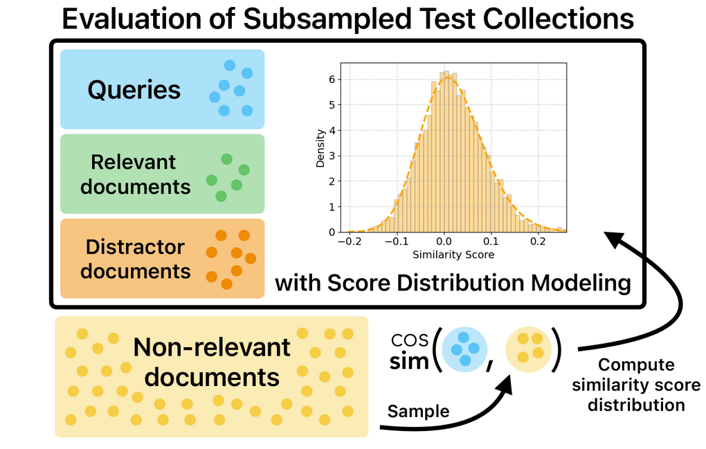

# Predicting Ranking Quality for Large-Scale Dense Information Retrieval via Score Distribution Modeling

[](TODO)
[](LICENSE)

This repository contains the source code accompanying the SIGIR submission:

> **Bridging the Gap Between Subsampled and Full-Corpus Evaluation**

---

## 🧩 Overview

Dense retrieval systems are increasingly evaluated on *subsampled* corpora to reduce computational and energy cost. While corpus subsampling preserves relevant documents and curated distractors, it **intentionally ignores the vast majority of non-relevant documents** in the original collection.

However, at large corpus scales, these unseen non-relevant documents influence ranking quality — especially at larger cut-off values (e.g., Recall@100, nDCG@100).

This repository implements **Score Distribution Modeling (SDM)**, a probabilistic extension to subsampled evaluation that:

* Estimates the distribution of similarity scores between a query and unseen non-relevant documents,
* Integrates this distribution analytically into ranking metric computation,
* Corrects the optimistic bias of subsampled evaluation,
* Preserves the efficiency advantages of corpus pooling.

<p align="center">
  
</p>

Experiments on:

* **TREC Deep Learning 2023 (CoRE benchmark)**
* Multiple **BEIR datasets**

show that SDM substantially narrows the gap between subsampled and full-corpus evaluation for **nDCG@k** and **Recall@k**, particularly at larger cut-offs.

---

# 🧠 Method

## What This Repository Implements

This repository contains the **exact implementations of ranking quality metrics that integrate modeled score distributions**, as introduced in the paper.

The core idea is:

1. For each query, we explicitly encode:

   * Relevant documents
   * Distractor documents (from corpus pooling)

2. Additionally, we sample and encode a small random set of documents that are:

   * Non-relevant to any query
   * Used solely to estimate the similarity score distribution of unseen background documents

3. We model the similarity scores between a query and unseen non-relevant documents as a random variable

$$
\delta_n^q \sim \mathcal{N}(\mu_q, \sigma_q^2)
$$

4. Instead of encoding the full corpus, we analytically estimate:

   * The expected number of unseen non-relevant documents that would exceed a score threshold
   * Their impact on ranking cut-offs
   * The corrected ranking metric

This allows us to compute expected values for:

* **Recall@k**
* **nDCG@k**
* (and potentially other ranking metrics)

while accounting for millions of unseen background documents without encoding them.

---

## Implementations of SDM-corrected ranking quality measures

All implementations of ranking quality metrics integrating score distributions can be found [here](src/sdm/utils/score_distribution.py):

```
src/sdm/utils/score_distribution.py
```

This file contains, among others, the logic for approximating Recall@k:

* Solves for the score threshold τₖ such that 

$$
E(numDocs \ge \tau_k) = k
$$

* Computes the expected contribution of unseen non-relevant documents

If you are interested in extending SDM to additional ranking metrics, this file is the correct starting point.

---

# 📊 Experiments

Our empirical evaluation follows Section 3 of the paper .

## Dense Retrievers Evaluated

We evaluate three dense retrievers:

* [**Snowflake Arctic M v1**](https://huggingface.co/Snowflake/snowflake-arctic-embed-m)
* [**Snowflake Arctic M v2**](https://huggingface.co/Snowflake/snowflake-arctic-embed-m-v2.0)
* [**Multilingual E5 Large Instruct**](https://huggingface.co/intfloat/multilingual-e5-large-instruct)

For BEIR corpus subsampling, we additionally pool runs from:

* **BM25**
* [**Jina Embeddings v3**](https://huggingface.co/jinaai/jina-embeddings-v3)

The pooled runs for:

* [BM25](results/BM25/) → `results/BM25/`
* [Jina v3](results/jinav3/) → `results/jinav3/`

are included in this repository.

---

## Datasets

### 1️⃣ TREC Deep Learning 2023 (CoRE benchmark)

We use the [**CoRE dataset collection**](https://github.com/padas-lab-de/CoRECT), which:

* Pools **28 public competitive runs** for passage retrieval
* Pools **4 competitive runs** for document retrieval
* Provides 10 relevant + 100 distractors per query

We rely on CoRE’s distractor mining process and do **not** create our own pooling for TREC DL ’23.

Exact full-corpus sizes:

* Passage: 100M
* Document: 10M

---

### 2️⃣ BEIR Datasets

We evaluate:

* DBPedia
* Climate-FEVER
* HotpotQA

For BEIR, we construct pooled corpora using:

* BM25
* Jina v3
* Rank fusion (CombMAX)

Additionally, for SDM we encode **10,000 randomly sampled non-relevant documents per dataset** to estimate the non-relevant score distribution.

---

# ⚙️ Installation

Clone the repository:

```bash
git clone https://github.com/padas-lab-de/sigir26-score-distribution-model.git
cd sigir26-score-distribution-model
```

### Using [Poetry](https://python-poetry.org/) (recommended)

```bash
poetry install
source $(poetry env info --path)/bin/activate
```

```bash
sdm --help
```

### Using Pip

```bash
python3 -m venv venv
source venv/bin/activate
pip install .
```

### Development: Run Code Formatting

To run the code formatting, you can use the following command:

```console
isort .
black .
```

The order of the commands is important. `isort` will sort the imports in the files, and `black` will format the code.

---

# 🚀 Usage

Below are the main entry points for reproducing the experiments.

---

## ▶ Experimental Study on CoRE (TREC DL ’23)

### SDM-based evaluation

```bash
sdm core [model_name] [passage|document]
```

`model_name` ∈ {snowflake, snowflakev2, e5, all}

Example:

```bash
sdm core snowflakev2 passage
```

---

### Exact full-corpus evaluation (very large)

> [!Note]
> This is intentionally lightweight in memory usage, but will take a long time due to full-corpus encoding.

```bash
sdm core-exact [model_name] [passage|document]
```

This script:

* Encodes the entire corpus

  * 100M passages OR
  * 10M documents
* Produces Top-1000 rankings per query
* Stores results under:

```
results/exact/snowflake/
results/exact/snowflakev2/
results/exact/e5/
```

---

## ▶ BEIR Evaluation

> [!Note]
> This command encodes the **entire test collection**.
> Depending on dataset size, this may take considerable time.

```bash
sdm beir [model_name] [dataset_name]
```

Example:

```bash
sdm beir e5 dbpedia
```

---

## ▶ Ablation Study

```bash
sdm ablation-study
```

This reproduces the analysis from Section 3.4 , demonstrating that a few thousand (e.g., 2,000–10,000) non-relevant samples are sufficient for stable score distribution estimation.

---

# 💾 Embedding Caching

All computed embeddings are stored under:

```
embeddings/
```

Embeddings are reused automatically, meaning each document is encoded only once.

---

# 📂 Repository Structure

```
src/sdm/
  ├── cli/
  │   ├── core.py
  │   ├── core-exact/
  │   ├── beir.py
  │   └── ablation-study.py
  ├── utils/
  │   └── score_distributions.py   # SDM metric implementations
results/
  ├── BM25/
  ├── jinav3/
  └── exact/
embeddings/
images/
```

---

# 🔗 Related Work

* Fröbe et al. (2025): *Corpus Subsampling: Estimating the Effectiveness of Neural Retrieval Models on Large Corpora*
* Reimers & Gurevych (2021): *The Curse of Dense Low-Dimensional IR for Large Index Sizes*
* Caspari et al. (2025): *CoRECT: A Framework for Evaluating Embedding Compression Techniques at Scale*

---

# 🪪 License

This project is licensed under the MIT License.
